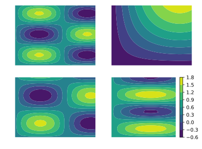
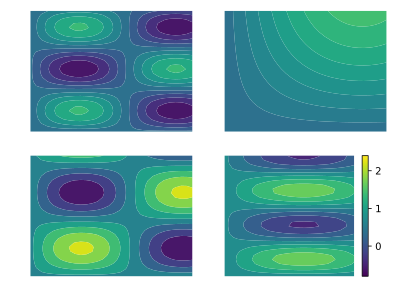

# SharedColorscale

To generates a colorscale that fits a series of contour plots, and apply it to them. The colormap is extended over the full range of data.

## Example

Let us generate four contour plots:

```python
from pylab import *

x, y = meshgrid( *[ linspace( 0, 1, 30 ) ]*2 )
figure, axs = subplots( nrows = 2, ncols = 2 )
mappables = []


for i, ax in enumerate( axs.flatten() ) :
    mappables += [ ax.contourf ( x, y, sin( 2*pi*2*rand()*x )*sin( 2*pi*2*rand()*y )*(1 + rand()) + rand() ) ]

colorbar()
```

The four colorscales are independent from each other, and the colorbar shows only the last one:



To generate a color scale that covers the entire data range, we call the `share_colorscale` function:

```python
from SharedColorscale import share_colorscale

colorbar( share_colorscale( mappables ) )
```

Here is the result:


